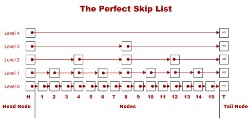

# SkipList
A skip list a multi-level linked list that has a head node and a tail node and a bunch of other element nodes. The element nodes are in sorted order, so that the searching time can be greatly reduced compared to a singly-linked list.  
Data structures:
```c
struct Node
{
    element;
    Node* next[];
};
struct SkipList
{
    int const maxLevel;
    int count;
    int currentLevel=0;
    Node* head;
    Node* tail;
};
```
## Random Level Skip List

A random level skip list is such a skip list that the level for each new node inserted is determined by a property called ``probability`` and the following function:
```
fun getlevel(probability) -> level
{
    random_num=Random(0,1)
    level=0
    while(random_num <= probability and level<maxLevel)
        ++level
    if(currentLevel<level)  //update currentLevel if a higher level is produced
        ++currentLevel
    return level
}
```
So that the probability of level=i when it's already (i-1), ie. ``P(level==i|level==i-1)=probability, P(level==i)=(probability)^i`` 

## Perfect Skip List
  
In a perfect skip list, ``currentLevel`` is determined only by the number of nodes. And the level of a new node is determined only by its index (the index of first node is 1) to be inserted. We use the following function to calculate its level.
```
fun getLevel(index) -> level
{
    if(index%2 != 0)
        return 0
    else
        return log2(index)
}
```

