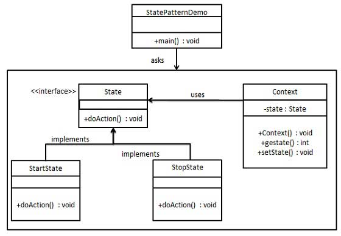

# Intro
The state pattern, a behavior pattern, is used to change a behavior of a class based on its state. The changes of the class behavior is **polymorphism**.
## Implementation
We define these classes:
- abstract class (interface)State
- class Context
- concrete state classes inherited from the Context class

## Example
In a drawing software, the canvas is going to behave differently according to the current selected tools like pen, pencil, eraser and etc. Instead of using ``if-else`` statement for each possible tools, we use a state pattern on the canvas class. So that in the future, if more tools are supported, we can simply adding another class without modifying existing code.
- Canvas => Context
- abstract drawing tool => State
- concrete different kinds of drawing tools => states